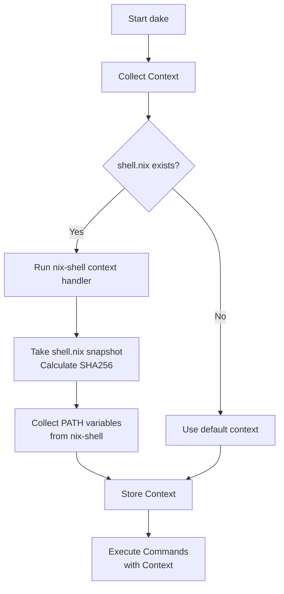

# dake

`dake` is a modern CLI tool management system built with Deno. While it shares similar syntax with Makefile, it's designed to handle the complex needs of modern development workflows and CLI tools, not as a build system.

## About

In today's development landscape, developers rely on numerous CLI tools, each requiring specific hooks and code generation capabilities. Traditional shell scripts and Makefiles often fall short in managing this complexity. dake addresses this challenge by providing a type-safe, efficient solution for CLI tool management and automation.

## How It Works

dake implements a sophisticated context handling system, similar to nix-shell:

### Context Handling Process

1. **Context Collection**
   - dake first looks for a `shell.nix` file in the current directory
   - This file defines the development environment and required tools

2. **nix-shell Context Handler**
   - When `shell.nix` is found, dake activates its nix-shell context handler
   - Takes a snapshot of `shell.nix` by calculating its SHA256 hash
   - This ensures reproducibility and tracks environment changes

3. **Environment Capture**
   - Collects PATH and environment variables from the nix-shell execution
   - Creates a complete snapshot of the development environment

4. **Context Usage**
   - All subsequent commands are executed within this captured context
   - Ensures consistent tool versions and environment across executions

## Features

### Type Safety
- **Type-safe Shell API**: Execute shell commands with confidence using TypeScript's type checking
- **Type-safe CLI Tool Integration**: Built-in type definitions for popular tools like git, nix-shell, and more
- **TypeScript-Based Scripting**: Write your automation scripts in TypeScript for better maintainability and IDE support

### Developer Experience
- **Easy Deployment**: 
  - Requires only Deno runtime (similar to Make)
  - Option to compile to a standalone binary
- **Performance**:
  - Multi-core support powered by Deno
  - Parallel task execution by default

### Productivity
- **Opinionated Defaults**:
  - Built-in nix-shell support
  - Streamlined configuration for common development scenarios
- **Modern Development Workflow**:
  - Designed for managing complex CLI tool interactions
  - Efficient handling of code generation hooks

## Requirements

- [Deno](https://deno.land/) runtime

## License

This project is licensed under the MIT License - see the [LICENSE](LICENSE) file for details.

## Author

Copyright (c) 2025 Coint
